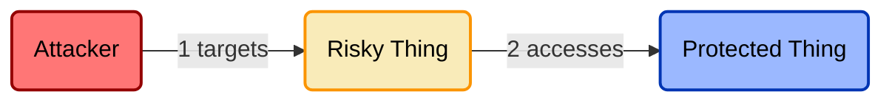

# Control Title
**ID:** DOMAIN.SUBDOMAIN.#

## Threat Overview
_Insert summary of threat that this control is relevant to_

## Threat Model


## Control Overview
_Insert summary of control_

## Control Model
 ```mermaid
flowchart LR
    u(User)
    c(Control)

    u-->|uses|c

    style c fill:#9ecea2,stroke:#015407,stroke-width:2px,color:#000000
```

## Control Tools
|Tool|Compatible Systems|
|-|-|
|[Tool Name](https://link.to.tool.lolol)|macOS, Windows, Linux, Android, iOS, Google Workspace, AWS, Azure, GCP, Okta|

## Control Framework Mappings
|Framework|Control ID(s)|
|-|-|
|SOX||
|SOC 2 (SSAE 18)||
|ISO 27001||
|NIST CSF 1||
|NIST CSF 2||
|NIST 800-53||
|FedRAMP||
|PCI DSS||
|HIPAA||
|GDPR||
|CCPA||
|CIS||

## References
* *Link to articles and other sources that help provide context about this control*
