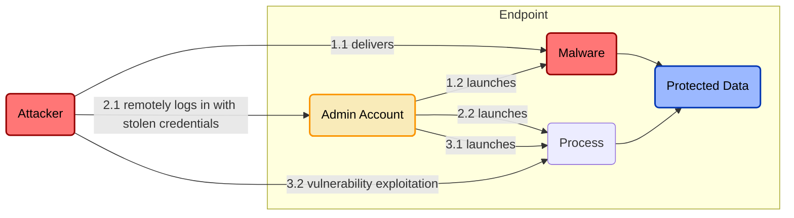

# Just-in-time-access (JITA) for endpoint administrator account privileges
**ID:** IAM.PAM.1

## Threat Overview
When targeting user or server endpoints, attackers will attempt to compromise an account with administrator privileges to more easily establish persistent access to the compromised endpoint and to gain access to sensitive data only accessible to privileged accounts (e.g. credentials stored in memory, which can be used to connect to other apps or systems).

## Threat Model


## Control Overview
Implementing JITA for local admin access requires a user to intentionally request admin privileges before using them. After a set period of time, the user's privileges are downgraded. 

This control is most beneficial for organizations that have a valid reason to provide some users with local admin access on their computers. By making local admin access temporary and only granted upon request, this control helps minimize the impact of an attacker exploiting vulnerable software, moving laterally with stolen credentials, or tricking users into executing malicious code on their endpoint.

## Control Model
 ```mermaid
flowchart LR
    u(User)
    j(JITA Request Tool)
    s[(SIEM)]
    t((Timer))

    u-->|1. submits local admin access request|j
    j-->|2. log request|s
    j-.->|3.1 start|t
    j---->|3.2 provide local admin|u    
    t-.->|4.1 end|j
    j-->|4.2 revoke local admin|u

    style j fill:#9ecea2,stroke:#015407,stroke-width:2px,color:#000000
```

## Control Tools
|Tool|Compatible Systems|Description|
|-|-|-|
|[Privileges](https://github.com/SAP/macOS-enterprise-privileges)|macOS|Stuff|
|[MakeMeAdmin](https://github.com/pseymour/MakeMeAdmin)|Windows|Stuff|
