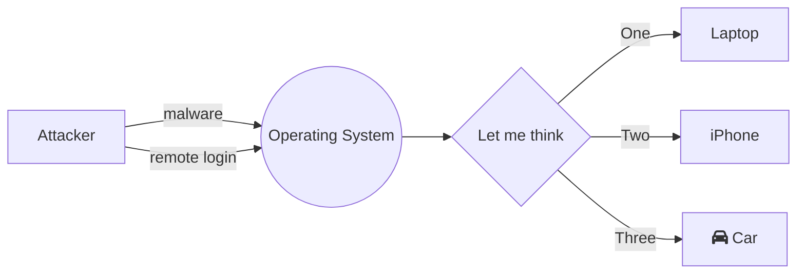
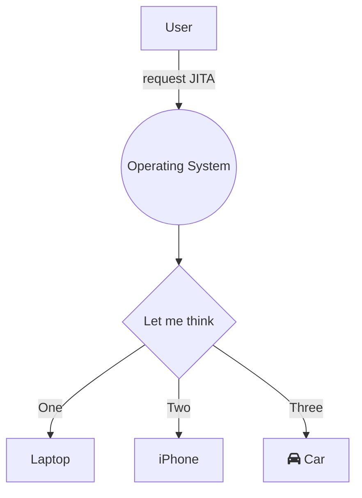

# Just-in-time-access (JITA) for local admin privileges
**ID:** IAM.PAM.1

## Description
Attackers 

## Threat Model

## Tools

|Tool|Compatible Systems|Description|
|-|-|-|
|[Privileges](https://github.com/SAP/macOS-enterprise-privileges)|macOS|Stuff|
|[MakeMeAdmin](https://github.com/pseymour/MakeMeAdmin)|Windows|Stuff|

## Processes

