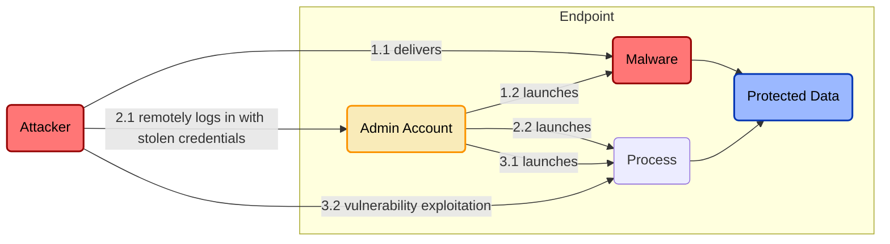
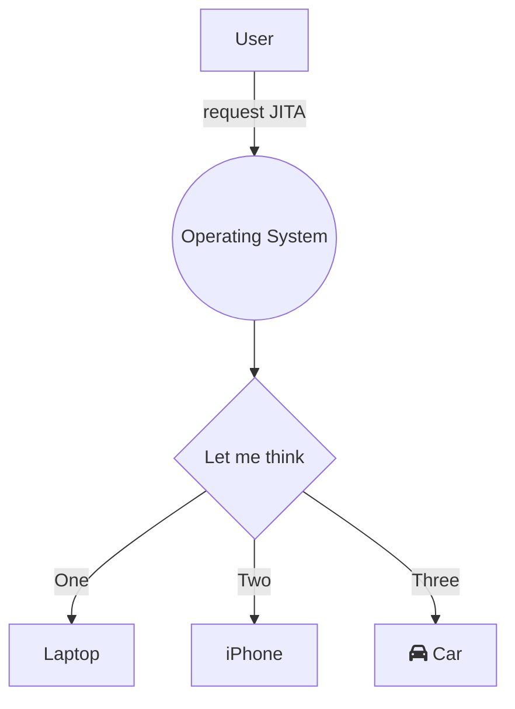

# Just-in-time-access (JITA) for endpoint administrator account privileges
**ID:** IAM.PAM.1

## Description
When targeting user or server endpoints, attackers will attempt to compromise an account with administrator privileges to more easily establish persistent access to the compromised endpoint and/or to gain access to sensitive data only accessible to privileged accounts (e.g. credentials stored in memory).

Implementing JITA for endpoint administrator account privileges requires an authorized user to intentionally request admin privileges before using them. After a set period of time, the user's privileges are downgraded.

An attacker that is unaware of this JITA control being present will have a harder time trying to obtain and use endpoint admin privileges. This can make it easier to detect an attacker who fails 

## Threat Model

## Tools

|Tool|Compatible Systems|Description|
|-|-|-|
|[Privileges](https://github.com/SAP/macOS-enterprise-privileges)|macOS|Stuff|
|[MakeMeAdmin](https://github.com/pseymour/MakeMeAdmin)|Windows|Stuff|

## Processes

